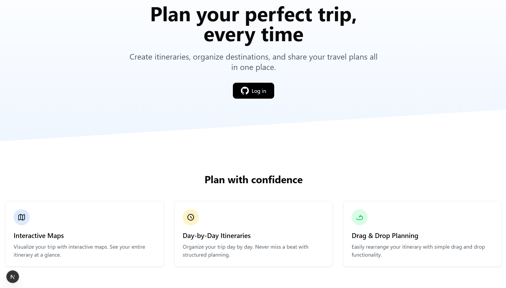

# 🌍 TripNest

A modern full-stack travel planner that helps users organize trips, build personalized itineraries, and visualize destinations with interactive Google Maps.

## 📸 Preview



---

## ✨ Features

* 🔐 Secure GitHub Authentication
* 🧳 Create and manage multiple trips
* 📝 Add detailed trip descriptions
* 🖼️ Upload custom trip cover images
* 📍 Search and add destinations with automatic geocoding
* 🗺️ Interactive Google Maps integration
* 📌 View trip destinations with map markers
* 🔄 Drag-and-drop itinerary reordering
* 📱 Fully responsive design
* ⚡ Fast server actions with Next.js

---

## 🛠️ Tech Stack

### Frontend

* Next.js 15
* React
* TypeScript
* Tailwind CSS
* shadcn/ui

### Backend

* Next.js Server Actions
* Prisma ORM
* Neon PostgreSQL
* NextAuth.js

### APIs & Services

* Google Maps JavaScript API
* Google Geocoding API
* UploadThing

---

## 🚀 Getting Started

### Clone the repository

```
git clone https://github.com/Lakshya-coder-1418/TripNest.git
cd tripnest
```

### Install dependencies

```
npm install
```

### Create `.env.local`

```
AUTH_GITHUB_ID=your_github_client_id
AUTH_GITHUB_SECRET=your_github_client_secret
AUTH_SECRET=your_auth_secret

UPLOADTHING_TOKEN=your_uploadthing_token

GOOGLE_MAPS_API_KEY=your_google_maps_api_key
NEXT_PUBLIC_GOOGLE_MAPS_API_KEY=your_google_maps_api_key
```

### Start the development server

```
npm run dev
```

Open [**http://localhost:3000**](http://localhost:3000) in your browser.

---

## 📂 Project Structure

```
app/
components/
lib/
prisma/
public/
```

---

## 🌟 Future Improvements

* 🤖 AI-powered itinerary recommendations
* 💰 Budget planner
* 🌦️ Weather forecasts
* 👥 Collaborative trip planning
* 📤 Trip sharing
* 📄 Export itinerary as PDF
* 📱 Offline support

---
